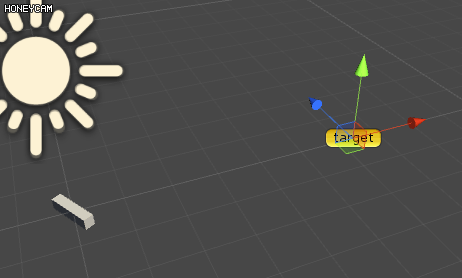
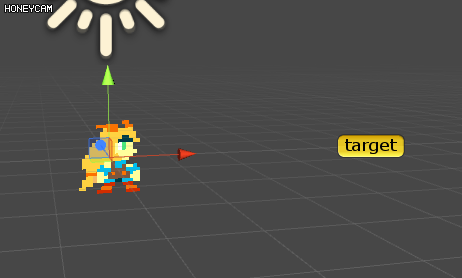
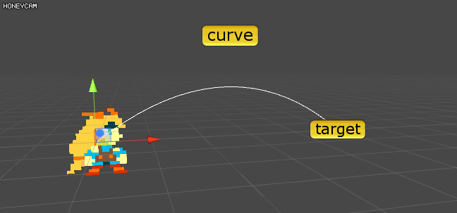

- use animator


just made by animator no code.


- gravity


```csharp
/// ref : answers.unity3d.com/questions/145972/how-to-make-enemy-canon-ball-fall-on-mooving-targe.html
public class MoveToTargetCurve : MonoBehaviour {
 
    public Vector3 gravity = new Vector3(0, -1000, 0);
    public Transform target;
 
    Vector3 m_power;
    float m_ground;
 
    private void Start()
    {
        var dir = target.position - transform.position;
        var h = dir.y;
        dir.y = 0;
        var dist = dir.magnitude;
        dir.y = dist;
        dist += h;
        var vel = Mathf.Sqrt(dist * gravity.magnitude);
 
        m_power = vel * dir.normalized;
        m_ground = target.position.y;
    }
  
    void Update() {
        if(m_ground <= transform.position.y )
        {
            transform.Translate(m_power * Time.deltaTime);
            m_power += gravity * Time.deltaTime;
        }
    }
}
```

- missile!


```csharp
public class MoveToTargetCurve : MonoBehaviour {
 
    public float power = 10;
    public float rotateSpeed = 10;
    public Transform target;
    
    void Update() {
        transform.rotation =  Quaternion.RotateTowards(transform.rotation, Quaternion.LookRotation(target.position - transform.position), rotateSpeed);
        transform.Translate(0, 0, power * Time.deltaTime);
        if ((transform.position - target.position).magnitude < 1)
            gameObject.SetActive(false);
    }
}
```

- circle

```csharp
public class MoveToTargetCurve : MonoBehaviour {
 
    public float height = 2.5;
    public Transform target;
    public float speed = 1f;
 
    Vector3 m_mid;
    Vector3 m_cosV;
    float angle = 0f;
 
    private void Start()
    {
        m_mid = (target.position + transform.position) / 2f;
        m_cosV = transform.position - m_mid;
    }
 
    void Update() {
        transform.position = m_cosV * Mathf.Cos(angle) + height * Vector3.up * Mathf.Sin(angle) + m_mid;
        angle += speed * Time.deltaTime;
    }
}
```

- bezier

```csharp
public class MoveToTargetCurve : MonoBehaviour {
 
    public Transform target;
    public Transform curvePoint;
    public float speed = 1f;
 
    float t = 0f;
    Vector3 m_start;
 
    private void Start()
    {
        m_start = transform.position;
    }
 
    void Update() {
        transform.position = Bezier(m_start, curvePoint.position, target.position, t);
        t = Mathf.Min(1, t + Time.deltaTime* speed);
  //debug
        for (float i = 0; i < 19; i++)
        {
            var a = Bezier(m_start, curvePoint.position, target.position, i * 1f / 20f);
            var b = Bezier(m_start, curvePoint.position, target.position, (i + 1f) * 1f / 20f);
            Debug.DrawLine(a, b);
        }
    }
 
    Vector3 Bezier(Vector3 a, Vector3 b, Vector3 c, float t)
    {
        var omt = 1f - t;
        return a * omt * omt + 2f*b * omt * t + c * t * t;
    }
}
```
