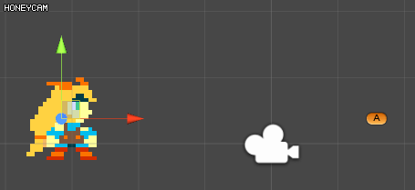
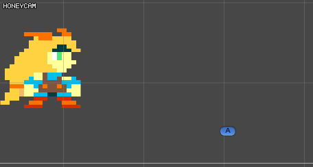

- use animator



just made by animator no code.


- gravity


```csharp
/// ref : answers.unity3d.com/questions/145972/how-to-make-enemy-canon-ball-fall-on-mooving-targe.html
public class MoveToTargetCurve : MonoBehaviour {
 
    public Vector3 gravity = new Vector3(0, -1000, 0);
    public Transform target;
 
    Vector3 m_power;
    float m_ground;
 
    private void Start()
    {
        var dir = target.position - transform.position;
        var h = dir.y;
        dir.y = 0;
        var dist = dir.magnitude;
        dir.y = dist;
        dist += h;
        var vel = Mathf.Sqrt(dist * gravity.magnitude);
 
        m_power = vel * dir.normalized;
        m_ground = target.position.y;
    }
  
    void Update() {
        if(m_ground <= transform.position.y )
        {
            transform.Translate(m_power * Time.deltaTime);
            m_power += gravity * Time.deltaTime;
        }
    }
}

```


