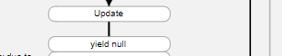

# IEnumerator for unity3d coroutine

## Basic 

Foreach
```csharp
public class MyComponent : MonoBehaviour{
    public void Start(){
        var numbers = new MyClass();
        foreach(var number in numbers){
            Debug.Log(number);
        }
    }
}

public class ForeachClass{
    //GetEnumerator is fixed name for foreach.
    public IEnumerator<float> GetEnumerator(){
        yield return 1f;
        yield return 2f;
        yield return 3f;
    }
}
```

IEnumerator class
```csharp

public class MyComponent : MonoBehaviour {

	void Start () {       
        var c2 = new IEnumeratorImplement();
        // c2 = (new ForeachClass()).GetEnumerator(); is same
        while (c2.MoveNext())
            Debug.Log(c2.Current);
    }

    public class IEnumeratorImplement : IEnumerator
    {
        float[] m_array = new float[] {  1f, 2f, 3f };
        int m_idx = -1;
        
        public object Current
        {
            get
            {
                return m_array[m_idx];
            }
        }
        
        public bool MoveNext()
        {
            m_idx++;
            if (m_idx >= 3)
                return false;
            return true;
        }

        public void Reset()
        {
            m_idx = -1;
        }
    }
}

```

Output
```
1
2
3
```

## Ref : Array Example
```csharp
public class MyArray<T>{
    T[] m_array;
    .
    .
    .
    public IEnumerator<T> GetEnumerator(){
        for(var n= 0 ; n < m_array.Lenght;n++)
          yield return m_arrray[n];
    }
}
```

## Ref : LinkedList Example
```csharp
public class MyLinkedList<T>{
    Node<T> first;
    .
    .
    .
    public IEnumerator<T> GetEnumerator(){
      var current = first;
      
      while(current != null) {      
        yield return current.data;
        current = current.next;
      }
    }
    
    public class Node<T> {
      public T data;
      public Node next;
    }
}
```

## Simplify virtual Unity3D loop


we consider only this part. Therefore, we assume that all coroutines return only null.
In fact, it will be more complicated because of things like WaitTimeForSecond.



```csharp
public static class Program{
    List<MonoBehaviour> m_components;
    List<IEnumerator> m_couroutines;
    
    public static void Main(){
        
        foreach(var c in m_components)
            c.Start();
        
        var checkTime = 0;
        
        while(true){    
            //mainloop
            checkTime = Time.time;
        
            foreach(var c in m_componets)
                c.Update();
            
            for( int n = m_coroutines.Lenght-1; n >= 0; n--)
                  if(!m_coroutines[n].MoveNext())
                      m_coroutines[n].removeAt(n);
            }
            
            Time.deltaTime = checkTime - Time.time
        }        
    }
}

```

