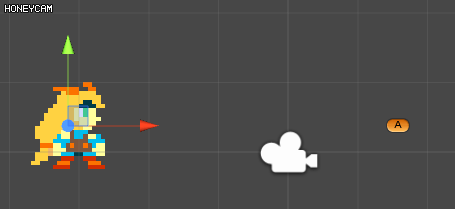
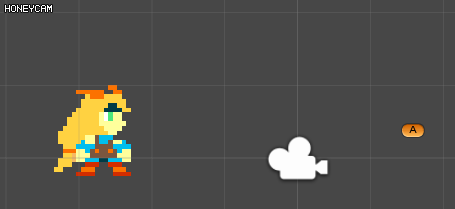

1.Super simple move


```csharp
public class MoveToTarget : MonoBehaviour {
    public Transform target;
    void Start () {
        if (target == null)
            return;
 
        transform.position = target.position;
    }
}
```

2.move 1m/s.


```csharp
public class MoveToTarget : MonoBehaviour {
 
    public Transform target;
    public float speed = 1f;

    private void Update()
    {
        if (target == null)
            return;
            
        transform.positon = Vector3.MoveTowards(transform.position, target.position, Time.deltatime*speed);
    }
 
}
```

3.move 1m for 1sec


```csharp
public class MoveToTarget : MonoBehaviour {
 
    public Transform target;
    public float moveTime = 1f;
 
    private void Start()
    {
        if (target == null)
            return;
        StartCoroutine(Tween(target.position, moveTime));
    }
    IEnumerator Tween(Vector3 end, float time)
    {
        var t = 0f;
        var start = transform.position;
        while(t < 1f)
        {
            t += Time.deltaTime/time;
            transform.position = Vector3.Lerp(start, end, t);
            yield return null;
        }
    }
}

```
