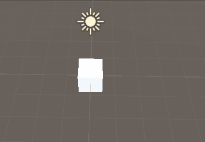

# Cube move 

link : https://cafe.naver.com/unityhub/95835 (korean)



```csharp
using System.Collections;
using System.Collections.Generic;
using UnityEngine;
using System;

public class CubeMover : MonoBehaviour
{

    private Action<Vector3> onDown;
    private Action<Vector3> onUp;
    private Action<Vector3> onRight;
    private Action<Vector3> onLeft;

    public float moveTime = 1f;
    public AnimationCurve curve = AnimationCurve.Linear(0,0,1,1);

    public Transform moveParent;

    void Start(){
        moveParent = (new GameObject("기준점")).transform;

        onDown = Move;
        onUp = Move;
        onLeft = Move;
        onRight = Move;
    }


    // Update is called once per frame
    void Update()
    {
        if(Input.GetKeyDown(KeyCode.DownArrow) && onDown != null)
            onDown(Vector3.back);
        if(Input.GetKeyDown(KeyCode.UpArrow) && onUp != null)
            onUp(Vector3.forward);
        if(Input.GetKeyDown(KeyCode.RightArrow) && onRight != null)
            onRight(Vector3.right);
        if(Input.GetKeyDown(KeyCode.LeftArrow) && onLeft != null)
            onLeft(Vector3.left);
    }

    bool m_isMoving = false;


    void Move(Vector3 direction){

        StartCoroutine(MoveRoutine(direction));
    }


    /// <summary>
    /// direction은 (1,0), (-1,0), (0,1), (0,-1)만을 가진다.
    /// </summary>
    /// <param name="direction"></param>
    /// <returns></returns>
    IEnumerator MoveRoutine(Vector3 direction){        
        if(m_isMoving )
            yield break;

        m_isMoving = true;
        
        var 기준점 = transform.position + direction/2f + Vector3.down/2f;
        moveParent.position = 기준점;
        var 돌리는축 = Vector3.Cross(direction, Vector3.up).normalized;

        transform.SetParent(moveParent);

        float t = 0f;
        var start = moveParent.rotation;

        var endEuler = moveParent.rotation.eulerAngles;
        endEuler -= 돌리는축 * 90f;

        var end = Quaternion.Euler(endEuler);
     
        while(t < 1f){

            t += Time.deltaTime/moveTime;
            moveParent.rotation = Quaternion.Lerp(start, end ,curve.Evaluate(t));
            yield return null;
        }
        transform.SetParent(null);

        moveParent.rotation= Quaternion.identity;

        m_isMoving = false;
    }
}
```
