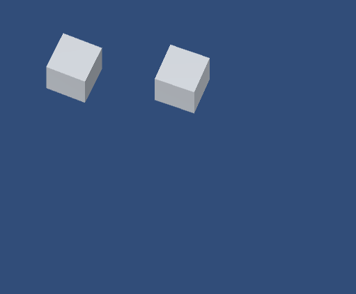
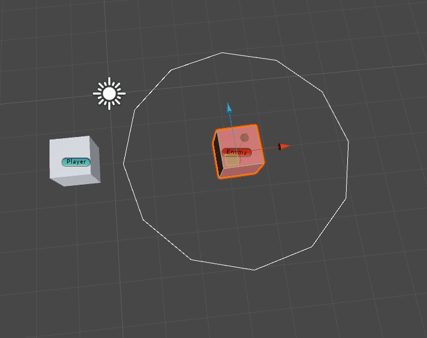
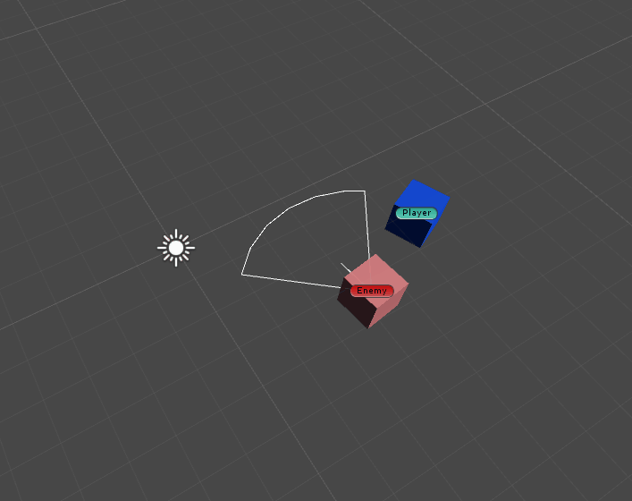

# DirectionAndRange

## BasicSetup

```csharp
public class MyController : MonoBehaviour {
    public float rotateSpeed = 10;
    public float moveSpeed = 2;

    // Update is called once per frame
    void Update () {

          transform.Translate(Vector3.forward * Input.GetAxis("Vertical")*Time.deltaTime* moveSpeed);
          transform.Rotate(Vector3.up * Input.GetAxis("Horizontal") * Time.deltaTime* rotateSpeed);
    }
}
```


two cube, controller, trailRenderer.

## 1.Range
```csharp

public class Enemy : MonoBehaviour {

    GameObject player;

    public void Start()
    {
        player = GameObject.Find("Player");
    }

    private void Update()
    {
        var dir = player.transform.position - transform.position;

        if(Vector3.Distance(transform.position, player.transform.position)< 3)
        {
            transform.rotation = Quaternion.RotateTowards(transform.rotation, Quaternion.LookRotation(dir, transform.up), 3f);
        }
    }

    private void OnDrawGizmos()
    {
        var dt = Mathf.PI / 12f;

        for (float t = 0f; t < Mathf.PI*2; t += dt)
        {
            Gizmos.DrawLine(GetPosByAngle(t), GetPosByAngle(t + dt));
        }

        Gizmos.DrawLine(transform.position, transform.position + transform.forward);
    }

    public Vector3 GetPosByAngle(float radian)
    {
        return transform.position+ 3*Vector3.right * Mathf.Cos(radian) + 3*Vector3.forward * Mathf.Sin(radian);
    }
}

```


Another way is to use OnTriggerEnter and Exit. 

* the above code is not correspond with gif. but i will remain.

## range with angle.
```csharp

public class Enemy : MonoBehaviour {

    GameObject player;

    public float range = 3f;
    public float rotationMaxSpeed = 3f;
    public float checkAngle = 30f;

    public void Start()
    {
        player = GameObject.Find("Player");
    }

    private void Update()
    {
        var dir = player.transform.position - transform.position;

        if(Vector3.Distance(transform.position, player.transform.position)< range &&
            Vector3.Angle(transform.forward, dir) < checkAngle/2f)
        {
            transform.rotation = Quaternion.RotateTowards(transform.rotation, Quaternion.LookRotation(dir, transform.up), rotationMaxSpeed);
        }
    }

    private void OnDrawGizmos()
    {
        var dt = Mathf.PI / 12f;
        var checkRadian = checkAngle * Mathf.Deg2Rad;

        Gizmos.DrawLine(transform.position, GetPosByAngle(-checkRadian / 2f));
        Gizmos.DrawLine(transform.position, GetPosByAngle(checkRadian / 2f));
        
        for (float t = -checkRadian / 2f; t < checkRadian / 2f; t += dt)
        {
            Gizmos.DrawLine(GetPosByAngle(t), GetPosByAngle(Mathf.Min( t + dt,checkRadian/2f)));
        }

        Gizmos.DrawLine(transform.position, transform.position + transform.forward);
    }

    Vector3 GetPosByAngle(float radian)
    {
        return transform.position+ range * transform.forward * Mathf.Cos(radian) + range * transform.right * Mathf.Sin(radian);
    }
}
```



