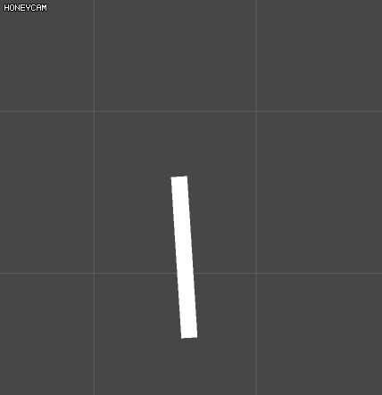
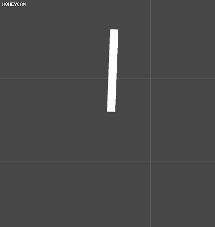
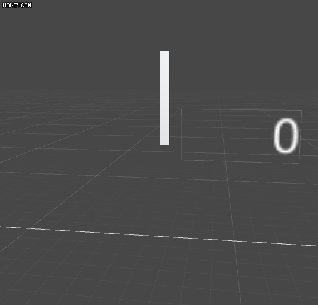
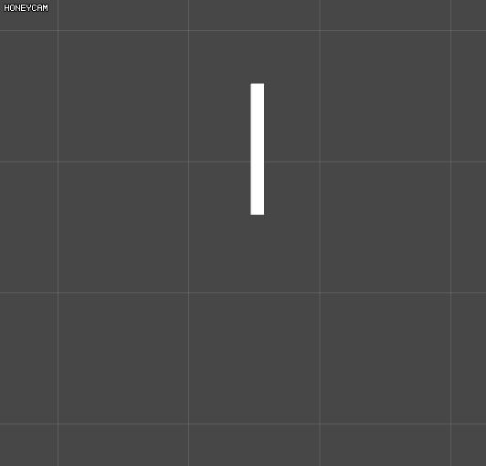

Rotation Exmaples
=====

## simple rotation
```csharp
private void Update()
{
    transform.Rotate(0, 0, Time.deltaTime * 100);
}
```


## clock rotation
```csharp
IEnumerator Start()
{
    while (true)
    {
        var t = 0f;
        var s = transform.rotation.eulerAngles.z;
        var e = s - 6;
        while(t < 1f)
        {
            t = Mathf.Clamp01(t+Time.deltaTime/0.1f);
            transform.localRotation = Quaternion.Lerp(Quaternion.Euler(0, 0, s), Quaternion.Euler(0, 0, e), t);
            yield return null;
        }
        yield return new WaitForSeconds(0.9f);
    }
    }
```


## angle between two vectors 
```csharp
public Transform other;
public Text angle;
private void Update()
{
    transform.Rotate(0, 0, Time.deltaTime * 100);
    angle.text = Mathf.RoundToInt(Vector3.Angle(transform.up, other.up)).ToString();
}
```


## NonLinearRotation 
```csharp
public AnimationCurve curve = AnimationCurve.EaseInOut(0,0,1,1);
public float rotationTime = 1f;
private IEnumerator Start()
{
    while(true)
    {
        var t = 0f;
        var s = transform.rotation.eulerAngles.z;
        var e = s - Random.Range(45,180);
        while (t < 1f)
        {
            t = Mathf.Clamp01(t + Time.deltaTime / rotationTime);
            transform.localRotation = Quaternion.Lerp(Quaternion.Euler(0, 0, s), Quaternion.Euler(0, 0, e), curve.Evaluate(t));
            yield return null;
        }
        yield return new WaitForSeconds(0.5f);
    }
}
```


