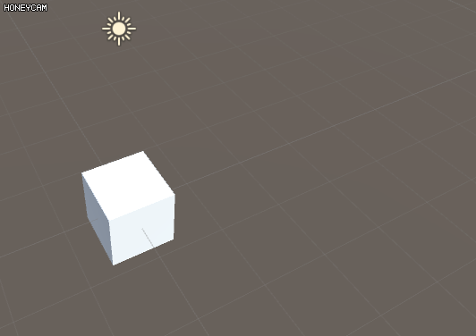
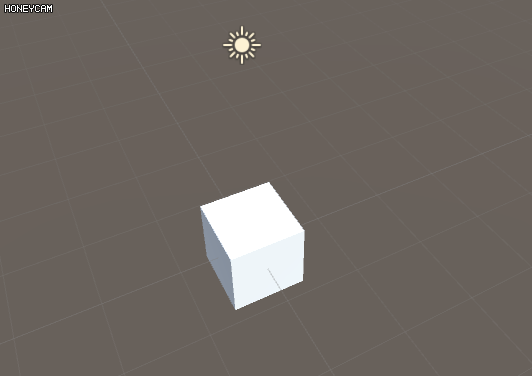
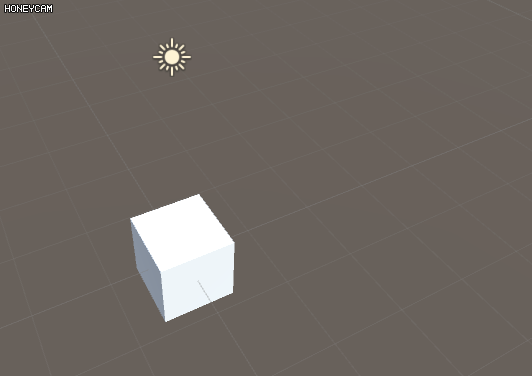
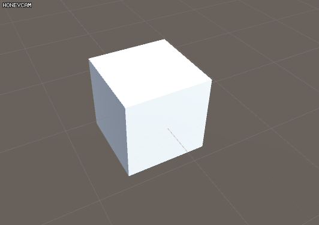

Vector3 Exmaples
=====
Vector3를 단순하게 정의하면 x, y, z의 값을 가지고 있는 구조체입니다. 이 값들이 다양한 무언가를 표현하기 때문에 어려움이 생깁니다. 이 값들은 위치일수도 있고 방향일 수도 있고 심지어 축으로 쓰일때도 있고 상대 좌표일수도 있고 회전값을 나타내는 오일러값일 수도 있습니다. 
이렇듯 유니티에서 Vector3는 여러가지 용도로 사용됩니다. 유니티에서 Vector3를 인수로 받는 함수들은 
인수명을 보고 각각 어떤 값을 쓰는지 알 수 있습니다. 예를들어 transform.LookAt를 보면 인수로 이름이 worldPosition인 Vector3가 들어 갑니다. 여기에는 위치값을 넣으면 됩니다. 여기서는 각각의 예를 보면서 개념을 잡아 보는 페이지입니다. 무언가 만들고 싶다면 반드시 하나하나가
무엇을 의미하는지 알아야 합니다.

## position
위치를 표현합니다. (10,-5,2) 라는 좌표가 있다면 x축으로 10, y축으로 -5, z축으로 2만큼 움직인 값입니다. 절대적인 좌표를 나타내는 worldPosition과 parent에 대한 상대적인 좌표를 나타내는 localPosition이 있습니다.
```csharp
private void Start()
{
    var position = new Vector3(1,1,1);
    transform.position = position;
}
```


## direction
방향을 표현합니다. 유니티에서는 (0,0,1)를 앞방향이라고 정의 되어 있습니다. transform.forward, transform.up, transform.right 등등 객체의 방향을 알 수 있는 프로퍼티들이 있습니다.
```csharp
private void Update()
{
    var direciton = new Vector3(0,1,0);
    transform.Translate(direction * Time.deltaTime);
}
```


## vector
벡터는 방향과 길이로 이루어져 있습니다. 이 벡터의 길이를 1로 만드는 것을 normalize라고 하며 길이 정보가 없어져 direction이 됩니다. localPosition는 parent에서 child에 대한 vector라고 볼 수 도 있습니다.
```csharp
private void Start()
{
    var vector = new Vector3(4,4,0);
    transform.Translate(vector);
}
```


## euler
각도를 표현할 때도 쓰입니다. 세가지 x축, y축, z축에 대하여 얼마나 회전되어 있는지를 표현합니다. Quaternion으로 변환해 주어야 rotation에 대입시킬 수 있습니다.
```csharp
private void Start()
{
    var euler = (0,45,0);
    transform.rotation = Quaternion.Euler(euler);
}
```


## axis
잘 사용되진 않습니다만 축을 표현할 때도 쓰입니다. (1,1,0)축은 x축과 y축 사이를 각각 45도 즉 반으로 가른 선을 축으로 나타내는 값입니다. 해당하는 축을 기준으로 회전시키는 예제입니다.
```csharp
private void Start()
{
    var axis = new Vector3(1,1,0);
    transform.Rotate(axis, Time.deltaTime*100);
}
```


## 형변환
두개의 포지션 A, B가 있을 때 A에서 B로 향하는 vector와 direction을 구해보는 예제입니다.
```csharp
private void Start()
{
    var A = new Vector3(2, 1, 0); 
    var B = new Vector3(1, 3, 0);
    var vectorAB = B - A;
    var directionAB = vectorAB.normalized;
}
```
